# API Quality Lab


REST API built with **Express** (Node.js), tested with **Jest + Supertest**, and linted with **ESLint**.

## Table of Contents

- [Tech Stack](#tech-stack)
- [Prerequisites](#prerequisites)
- [Installation](#installation)
- [Commands](#commands)
- [Structure](#structure)
- [Why separate app.js and server.js?](#why-separate-appjs-and-serverjs)
- [A1 — Utility Functions](#a1--utility-functions)
  - [capitalize](#capitalize)
  - [calculateAverage](#calculateaverage)
  - [slugify](#slugify)
  - [clamp](#clamp)
- [A2 — Validators](#a2--validators)
  - [isValidEmail](#isvalidemail)
  - [isValidPassword](#isvalidpassword)
  - [isValidAge](#isvalidage)
- [A3 — Reading failing tests](#a3--reading-failing-tests)
  - [Bug 1 — calculateAverage: division replaced by multiplication](#bug-1--calculateaverage-division-replaced-by-multiplication)
  - [Bug 2 — isValidEmail: missing @ check](#bug-2--isvalidemail-missing--check)
  - [Bug 3 — capitalize: missing toLowerCase](#bug-3--capitalize-missing-tolowercase)
- [A4 — TDD: sortStudents](#a4--tdd-sortstudents)
  - [Red/Green cycles](#redgreen-cycles)
- [Issues encountered](#issues-encountered)

## Tech Stack

| Role | Tool |
|---|---|
| Runtime | Node.js |
| HTTP Framework | Express |
| Tests + HTTP tests | Jest + Supertest |
| Coverage | Jest `--coverage` (built-in) |
| Linter | ESLint v9 |

## Prerequisites

- Node.js (v18+)
- npm

## Installation

```bash
npm install
```

## Commands

```bash
# Run tests
npm test

# Run tests with coverage
npm run test:coverage

# Run linter
npm run lint

# Start the server
npm start
```

## Structure

```
src/
  app.js         # Express config: routes + middleware (no listen)
  server.js      # Starts the server on port 3000
  utils.js       # Utility functions: capitalize, calculateAverage, slugify, clamp, sortStudents
  validators.js  # Validators: isValidEmail, isValidPassword, isValidAge
tests/
  app.test.js        # HTTP tests with Supertest
  utils.test.js      # Unit tests for utility functions (41 tests)
  validators.test.js # Unit tests for validators (23 tests)
docs/
  screenshots/   # Screenshots of RED/GREEN cycles and bug analyses
```

## Why separate app.js and server.js?

`app.js` sets up routes without starting a server. Tests import `app.js` directly — Supertest spins up an in-memory server, no port needed. `server.js` is only used in production via `npm start`.

---

## A1 — Utility Functions

Unit tests for pure utility functions. Each function is tested across normal inputs, edge cases, and invalid inputs. Tests follow the **AAA pattern** (Arrange / Act / Assert) and the `should [result] when [condition]` naming convention.

### capitalize

Uppercases the first alphabetic character, lowercases the rest.

| Input | Expected output |
|---|---|
| `"hello"` | `"Hello"` |
| `"WORLD"` | `"World"` |
| `""` | `""` |
| `null` | `""` |
| `"a"` | `"A"` |
| `"hello2world"` | `"Hello2world"` |
| `"!hello"` | `"!Hello"` |

### calculateAverage

Returns the average of an array of numbers, rounded to 2 decimal places. Throws a `TypeError` if the array contains a non-number.

| Input | Expected output |
|---|---|
| `[10, 12, 14]` | `12` |
| `[15]` | `15` |
| `[]` | `0` |
| `null` | `0` |
| `[-10, -5]` | `-7.5` |
| `[1, 2]` | `1.5` |
| `[1.005, 1.006]` | `1.01` |
| `[1, 'abc', 3]` | throws `TypeError` |

### slugify

Transforms a string into a URL-friendly slug: special characters removed first, then lowercase, spaces replaced by dashes, leading/trailing dashes stripped.

| Input | Expected output |
|---|---|
| `"Hello World"` | `"hello-world"` |
| `" Spaces Everywhere "` | `"spaces-everywhere"` |
| `"C'est l'ete !"` | `"cest-lete"` |
| `""` | `""` |
| `"hello   world"` | `"hello-world"` |
| `"!!!"` | `""` |
| `"Hello 123 World"` | `"hello-123-world"` |
| `"hello ! world"` | `"hello-world"` |

### clamp

Constrains a value between a minimum and a maximum.

| Input | Expected output |
|---|---|
| `clamp(5, 0, 10)` | `5` |
| `clamp(-5, 0, 10)` | `0` |
| `clamp(15, 0, 10)` | `10` |
| `clamp(0, 0, 0)` | `0` |
| `clamp(0, 0, 10)` | `0` |
| `clamp(10, 0, 10)` | `10` |
| `clamp(-3, -5, -1)` | `-3` |
| `clamp('a', 0, 10)` | throws `TypeError` |

---

## A2 — Validators

Validation functions for user input. Each function returns either a boolean or a detailed object with errors.

### isValidEmail

Returns `true` if the email contains a local part, `@`, a domain and a `.`.

| Input | Expected output |
|---|---|
| `"user@example.com"` | `true` |
| `"user.name+tag@domain.co"` | `true` |
| `"invalid"` | `false` |
| `"@domain.com"` | `false` |
| `"user@"` | `false` |
| `""` | `false` |
| `null` | `false` |

### isValidPassword

Returns `{ valid: boolean, errors: string[] }`. Validates 5 rules independently.

| Input | Expected output |
|---|---|
| `"Passw0rd!"` | `{ valid: true, errors: [] }` |
| `"short"` | `{ valid: false, errors: [length, uppercase, digit, special] }` |
| `"alllowercase1!"` | missing uppercase error |
| `"ALLUPPERCASE1!"` | missing lowercase error |
| `"NoDigits!here"` | missing digit error |
| `"NoSpecial1here"` | missing special character error |
| `""` | `{ valid: false, errors: [5 errors] }` |
| `null` | `{ valid: false, errors: [5 errors] }` |

### isValidAge

Returns `true` if the age is an integer between 0 and 150 (inclusive).

| Input | Expected output |
|---|---|
| `25` | `true` |
| `0` | `true` |
| `150` | `true` |
| `-1` | `false` |
| `151` | `false` |
| `25.5` | `false` |
| `"25"` | `false` |
| `null` | `false` |

---

## A3 — Reading failing tests

The goal of this exercise is to learn how to read test error messages. Each bug was introduced intentionally, tests were run, and the output was analysed before fixing.

---

### Bug 1 — calculateAverage: division replaced by multiplication

**Change made:** replaced `/` by `*` in `calculateAverage`.

```js
// buggy
return parseFloat((sum * numbers.length).toFixed(2));
```

**Tests failed:** 4 out of 7 — all cases where the result is not 0 or 1-element arrays.

**Reading the errors:**

`[10, 12, 14]` → sum is `36`, multiplied by `3` gives `108` instead of `12`.

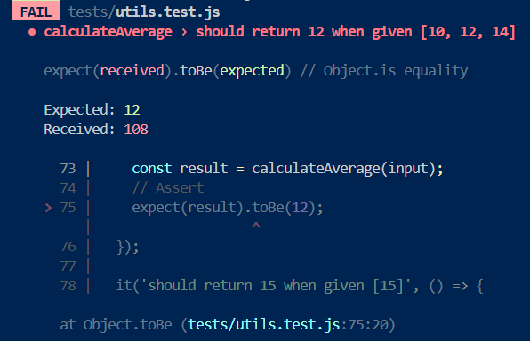

`[-10, -5]` → sum is `-15`, multiplied by `2` gives `-30` instead of `-7.5`.

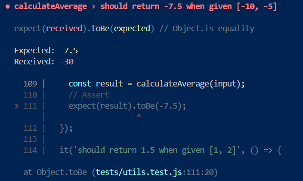

`[1, 2]` → sum is `3`, multiplied by `2` gives `6` instead of `1.5`.

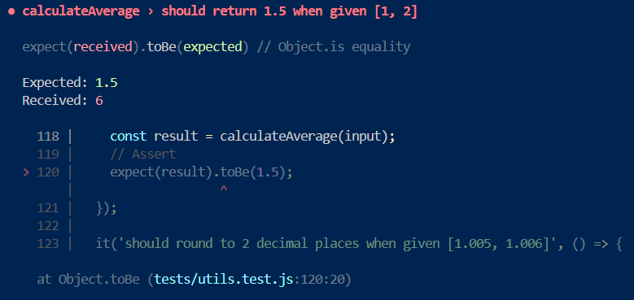

`[1.005, 1.006]` → sum is `2.011`, multiplied by `2` gives `4.02` instead of `1.01`.

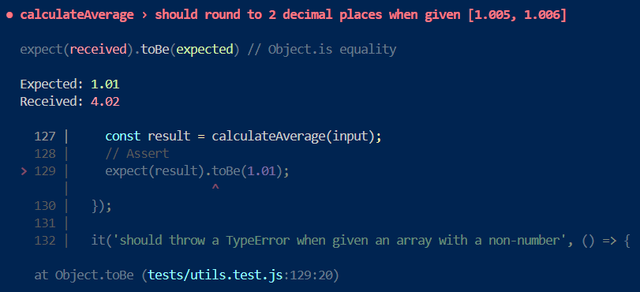

**Why the other tests still passed:** `[15]` — single element, sum × 1 = sum / 1. `[]` and `null` — early return `0`, never reaches the formula.

**Fix:** restore `/`.

---

### Bug 2 — isValidEmail: missing @ check

**Change made:** removed `@` from the regex in `isValidEmail`.

```js
// buggy
return /^[^\s@]+[^\s@]+\.[^\s@]+$/.test(email);
```

**Tests failed:** 2 out of 7 — the two valid email cases.

**Reading the errors:**

`"user@example.com"` → received `false` instead of `true`. Without `@` in the regex, the pattern no longer matches valid emails containing `@`.

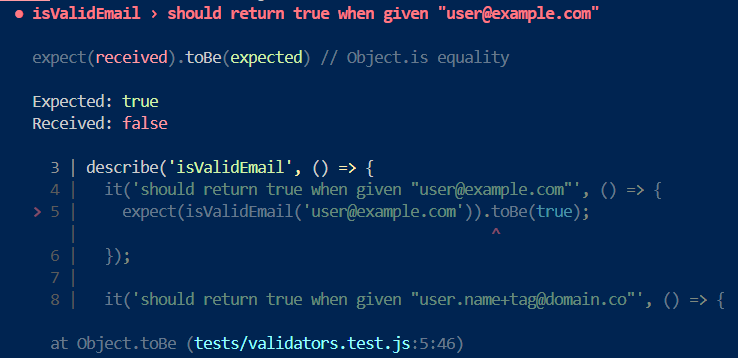

`"user.name+tag@domain.co"` → same issue.

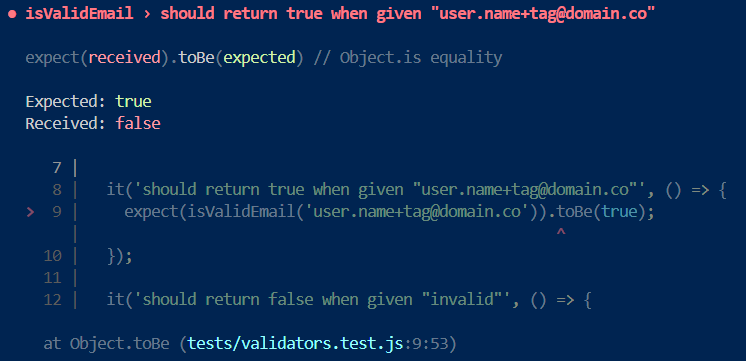

**Why the other tests still passed:** the invalid cases (`"invalid"`, `"@domain.com"`, `"user@"`, `""`, `null`) were already expected to return `false` — the broken regex still returned `false` for them, so those tests passed by coincidence.

**Fix:** restore `@` in the regex.

---

### Bug 3 — capitalize: missing toLowerCase

**Change made:** removed `.toLowerCase()` from `capitalize`.

```js
// buggy
return str.slice(0, index) + str[index].toUpperCase() + str.slice(index + 1);
```

**Tests failed:** 1 out of 7 — only `"WORLD"`.

**Reading the error:**

`"WORLD"` → received `"WORLD"` instead of `"World"`. Without `.toLowerCase()`, the remaining characters keep their original case.

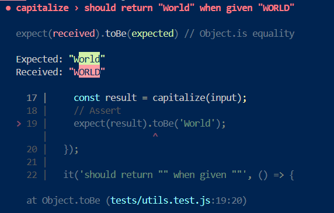

**Why the other tests still passed:** `"hello"`, `"a"`, `"hello2world"`, `"!hello"` — all inputs were already lowercase, so removing `.toLowerCase()` had no effect. `""` and `null` — early return, never reaches the logic.

**Fix:** restore `.toLowerCase()` on `str.slice(index + 1)`.

---

## A4 — TDD: sortStudents

`sortStudents(students, sortBy, order)` sorts an array of `{ name, grade, age }` objects by any field in ascending or descending order. Built using strict TDD: each test was written first (RED), then the minimum code was written to make it pass (GREEN).

**Signature:**
```js
sortStudents(students, sortBy, order = 'asc')
```

| Parameter | Type | Description |
|---|---|---|
| `students` | `array` | Array of `{ name, grade, age }` objects |
| `sortBy` | `string` | `"name"`, `"grade"` or `"age"` |
| `order` | `string` | `"asc"` (default) or `"desc"` |

### Red/Green cycles

**Test 1 — sort by grade ascending**

RED: function didn't exist yet → `TypeError: sortStudents is not a function`

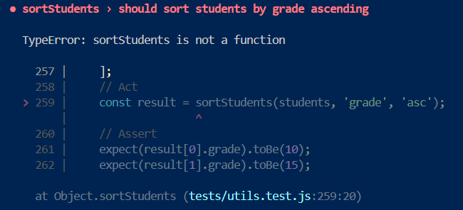

GREEN: implemented minimum — sort by `grade` ascending only, `order` ignored.

---

**Test 2 — sort by grade descending**

RED: `order` parameter ignored → result was ascending instead of descending.

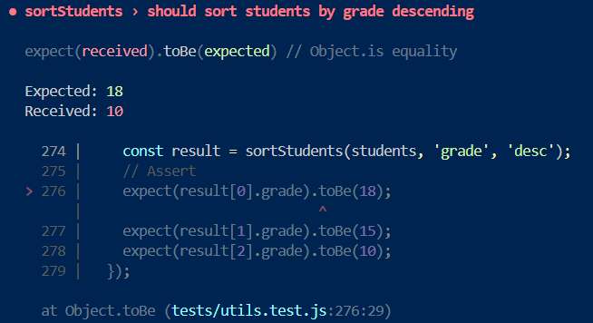

GREEN: added `order === 'asc'` condition to reverse comparison.

---

**Test 3 — sort by name ascending**

RED: `sortBy` parameter ignored, always sorted by `grade`.

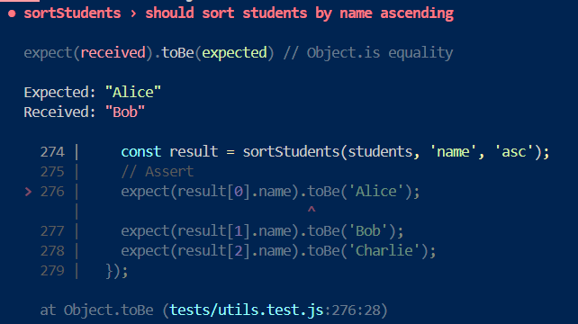

GREEN: replaced `a.grade` with `a[sortBy]` to support any field.

---

**Tests 4, 6, 7, 8 — age / empty / original / default order**

These were **free tests** — the existing implementation already handled these cases correctly. No code change needed.

---

**Test 5 — null input**

RED: `null` passed to spread operator → `TypeError: students is not iterable`

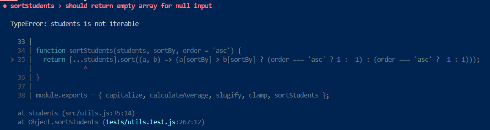

GREEN: added `if (!students) return []` guard.

---

## Issues encountered

**ESLint — `require` / `module` / `process` not defined**

ESLint v9 does not assume any runtime environment by default. It flagged Node.js globals (`require`, `module`, `process`, `console`) as undefined.

Fix: explicitly declare the Node.js globals in `eslint.config.js` using the `globals` package:

```js
const globals = require('globals');

languageOptions: {
  globals: {
    ...globals.node,
  },
},
```

---

**slugify — trailing dash on input ending with a special character**

Input `"C'est l'ete !"` was producing `"cest-lete-"` instead of `"cest-lete"`.

Root cause: the space before `!` was converted to `-`, then `!` was removed — leaving a trailing dash.

Fix: add a `.replace(/^-+|-+$/g, '')` step to strip leading and trailing dashes after cleanup.

---

**slugify — double dash when a special character is surrounded by spaces**

Input `"hello ! world"` was producing `"hello--world"` instead of `"hello-world"`.

Root cause: spaces were replaced by dashes before special characters were removed — `"hello-!-world"` → `"hello--world"`.

Fix: remove special characters **before** replacing spaces with dashes:

```js
return text
  .trim()
  .toLowerCase()
  .replace(/[^a-z0-9\s-]/g, '') // remove special chars first
  .replace(/\s+/g, '-')          // then replace spaces
  .replace(/^-+|-+$/g, '');      // strip leading/trailing dashes
```

---

**clamp — non-number arguments produce NaN silently**

`clamp('a', 0, 10)` would return `NaN` without error because `Math.max('a', 0)` propagates `NaN` silently in JavaScript.

Fix: validate all three arguments upfront and throw a `TypeError` if any is not a number:

```js
if (typeof value !== 'number' || typeof min !== 'number' || typeof max !== 'number') {
  throw new TypeError('value, min and max must be numbers');
}
```

---

**capitalize — special character at the start**

`"!hello"` was producing `"!hello"` instead of `"!Hello"` because `charAt(0)` was targeting `!`, not the first letter.

Fix: use `str.search(/[a-zA-Z]/)` to find the index of the first alphabetic character:

```js
const index = str.search(/[a-zA-Z]/);
if (index === -1) return str;
return str.slice(0, index) + str[index].toUpperCase() + str.slice(index + 1).toLowerCase();
```
