# API Quality Lab


REST API built with **Express** (Node.js), tested with **Jest + Supertest**, and linted with **ESLint**.

## Table of Contents

- [Tech Stack](#tech-stack)
- [Prerequisites](#prerequisites)
- [Installation](#installation)
- [Commands](#commands)
- [Structure](#structure)
- [Why separate app.js and server.js?](#why-separate-appjs-and-serverjs)
- [A1 — Utility Functions](#a1--utility-functions)
  - [capitalize](#capitalize)
  - [calculateAverage](#calculateaverage)
  - [slugify](#slugify)
  - [clamp](#clamp)
- [A2 — Validators](#a2--validators)
  - [isValidEmail](#isvalidemail)
  - [isValidPassword](#isvalidpassword)
  - [isValidAge](#isvalidage)
- [A3 — Reading failing tests](#a3--reading-failing-tests)
  - [Bug 1 — calculateAverage: division replaced by multiplication](#bug-1--calculateaverage-division-replaced-by-multiplication)
  - [Bug 2 — isValidEmail: missing @ check](#bug-2--isvalidemail-missing--check)
  - [Bug 3 — capitalize: missing toLowerCase](#bug-3--capitalize-missing-tolowercase)
- [A4 — TDD: sortStudents](#a4--tdd-sortstudents)
  - [Red/Green cycles](#redgreen-cycles)
- [A5 — parsePrice](#a5--parseprice)
- [A6 — groupBy](#a6--groupby)
  - [Red/Green cycles](#redgreen-cycles-1)
- [A7 — calculateDiscount](#a7--calculatediscount)
  - [percentage rules](#percentage-rules)
  - [fixed rules](#fixed-rules)
  - [buyXgetY rules](#buyxgety-rules)
- [B1 — Pricing Engine](#b1--pricing-engine)
  - [calculateDeliveryFee](#calculatedeliveryfee)
  - [applyPromoCode](#applypromocode)
  - [calculateSurge](#calculatesurge)
  - [calculateOrderTotal](#calculateordertotal)
- [B2 — HTTP API](#b2--http-api)
  - [POST /orders/simulate](#post-orderssimulate)
  - [POST /orders](#post-orders)
  - [GET /orders/:id](#get-ordersid)
  - [POST /promo/validate](#post-promovalidate)
- [B3 — Code Coverage](#b3--code-coverage)
- [Issues encountered](#issues-encountered)

## Tech Stack

| Role | Tool |
|---|---|
| Runtime | Node.js |
| HTTP Framework | Express |
| Tests + HTTP tests | Jest + Supertest |
| Coverage | Jest `--coverage` (built-in) |
| Linter | ESLint v9 |

## Prerequisites

- Node.js (v18+)
- npm

## Installation

```bash
npm install
```

## Commands

```bash
# Run tests
npm test

# Run tests with coverage
npm run test:coverage

# Run linter
npm run lint

# Start the server
npm start
```

## Structure

```
src/
  app.js            # Express config: routes + error middleware (no listen)
  server.js         # Starts the server on port 3000
  utils.js          # Utility functions: capitalize, calculateAverage, slugify, clamp, sortStudents, parsePrice, groupBy, calculateDiscount
  validators.js     # Validators: isValidEmail, isValidPassword, isValidAge
  pricing.js        # Pricing engine: calculateDeliveryFee, applyPromoCode, calculateSurge, calculateOrderTotal
  promoCodes.js     # In-memory promo codes list
  routes/
    orders.js       # POST /orders/simulate, POST /orders, GET /orders/:id
    promo.js        # POST /promo/validate
tests/
  app.test.js        # HTTP tests with Supertest
  utils.test.js      # Unit tests for utility functions (60+ tests)
  validators.test.js # Unit tests for validators (23 tests)
  pricing.test.js    # Unit tests for pricing functions (58 tests)
  api.test.js        # Integration tests for HTTP routes (20 tests)
docs/
  screenshots/   # Screenshots of RED/GREEN cycles and bug analyses
```

## Why separate app.js and server.js?

`app.js` sets up routes without starting a server. Tests import `app.js` directly — Supertest spins up an in-memory server, no port needed. `server.js` is only used in production via `npm start`.

---

## A1 — Utility Functions

Unit tests for pure utility functions. Each function is tested across normal inputs, edge cases, and invalid inputs. Tests follow the **AAA pattern** (Arrange / Act / Assert) and the `should [result] when [condition]` naming convention.

### capitalize

Uppercases the first alphabetic character, lowercases the rest.

| Input | Expected output |
|---|---|
| `"hello"` | `"Hello"` |
| `"WORLD"` | `"World"` |
| `""` | `""` |
| `null` | `""` |
| `"a"` | `"A"` |
| `"hello2world"` | `"Hello2world"` |
| `"!hello"` | `"!Hello"` |

### calculateAverage

Returns the average of an array of numbers, rounded to 2 decimal places. Throws a `TypeError` if the array contains a non-number.

| Input | Expected output |
|---|---|
| `[10, 12, 14]` | `12` |
| `[15]` | `15` |
| `[]` | `0` |
| `null` | `0` |
| `[-10, -5]` | `-7.5` |
| `[1, 2]` | `1.5` |
| `[1.005, 1.006]` | `1.01` |
| `[1, 'abc', 3]` | throws `TypeError` |

### slugify

Transforms a string into a URL-friendly slug: special characters removed first, then lowercase, spaces replaced by dashes, leading/trailing dashes stripped.

| Input | Expected output |
|---|---|
| `"Hello World"` | `"hello-world"` |
| `" Spaces Everywhere "` | `"spaces-everywhere"` |
| `"C'est l'ete !"` | `"cest-lete"` |
| `""` | `""` |
| `"hello   world"` | `"hello-world"` |
| `"!!!"` | `""` |
| `"Hello 123 World"` | `"hello-123-world"` |
| `"hello ! world"` | `"hello-world"` |

### clamp

Constrains a value between a minimum and a maximum.

| Input | Expected output |
|---|---|
| `clamp(5, 0, 10)` | `5` |
| `clamp(-5, 0, 10)` | `0` |
| `clamp(15, 0, 10)` | `10` |
| `clamp(0, 0, 0)` | `0` |
| `clamp(0, 0, 10)` | `0` |
| `clamp(10, 0, 10)` | `10` |
| `clamp(-3, -5, -1)` | `-3` |
| `clamp('a', 0, 10)` | throws `TypeError` |

---

## A2 — Validators

Validation functions for user input. Each function returns either a boolean or a detailed object with errors.

### isValidEmail

Returns `true` if the email contains a local part, `@`, a domain and a `.`.

| Input | Expected output |
|---|---|
| `"user@example.com"` | `true` |
| `"user.name+tag@domain.co"` | `true` |
| `"invalid"` | `false` |
| `"@domain.com"` | `false` |
| `"user@"` | `false` |
| `""` | `false` |
| `null` | `false` |

### isValidPassword

Returns `{ valid: boolean, errors: string[] }`. Validates 5 rules independently.

| Input | Expected output |
|---|---|
| `"Passw0rd!"` | `{ valid: true, errors: [] }` |
| `"short"` | `{ valid: false, errors: [length, uppercase, digit, special] }` |
| `"alllowercase1!"` | missing uppercase error |
| `"ALLUPPERCASE1!"` | missing lowercase error |
| `"NoDigits!here"` | missing digit error |
| `"NoSpecial1here"` | missing special character error |
| `""` | `{ valid: false, errors: [5 errors] }` |
| `null` | `{ valid: false, errors: [5 errors] }` |

### isValidAge

Returns `true` if the age is an integer between 0 and 150 (inclusive).

| Input | Expected output |
|---|---|
| `25` | `true` |
| `0` | `true` |
| `150` | `true` |
| `-1` | `false` |
| `151` | `false` |
| `25.5` | `false` |
| `"25"` | `false` |
| `null` | `false` |

---

## A3 — Reading failing tests

The goal of this exercise is to learn how to read test error messages. Each bug was introduced intentionally, tests were run, and the output was analysed before fixing.

---

### Bug 1 — calculateAverage: division replaced by multiplication

**Change made:** replaced `/` by `*` in `calculateAverage`.

```js
// buggy
return parseFloat((sum * numbers.length).toFixed(2));
```

**Tests failed:** 4 out of 7 — all cases where the result is not 0 or 1-element arrays.

**Reading the errors:**

`[10, 12, 14]` → sum is `36`, multiplied by `3` gives `108` instead of `12`.

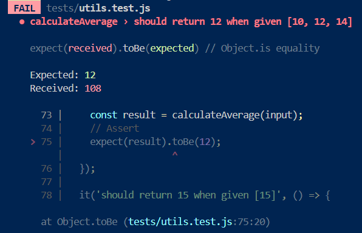

`[-10, -5]` → sum is `-15`, multiplied by `2` gives `-30` instead of `-7.5`.

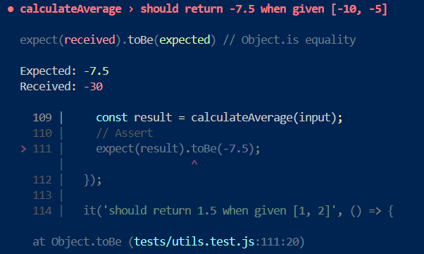

`[1, 2]` → sum is `3`, multiplied by `2` gives `6` instead of `1.5`.

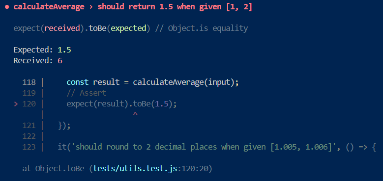

`[1.005, 1.006]` → sum is `2.011`, multiplied by `2` gives `4.02` instead of `1.01`.

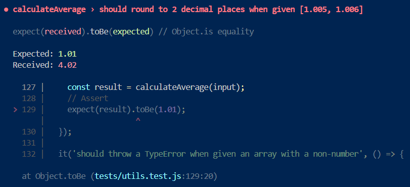

**Why the other tests still passed:** `[15]` — single element, sum × 1 = sum / 1. `[]` and `null` — early return `0`, never reaches the formula.

**Fix:** restore `/`.

---

### Bug 2 — isValidEmail: missing @ check

**Change made:** removed `@` from the regex in `isValidEmail`.

```js
// buggy
return /^[^\s@]+[^\s@]+\.[^\s@]+$/.test(email);
```

**Tests failed:** 2 out of 7 — the two valid email cases.

**Reading the errors:**

`"user@example.com"` → received `false` instead of `true`. Without `@` in the regex, the pattern no longer matches valid emails containing `@`.

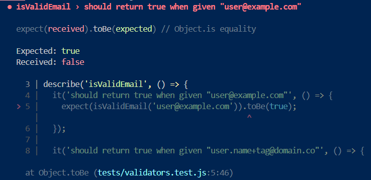

`"user.name+tag@domain.co"` → same issue.

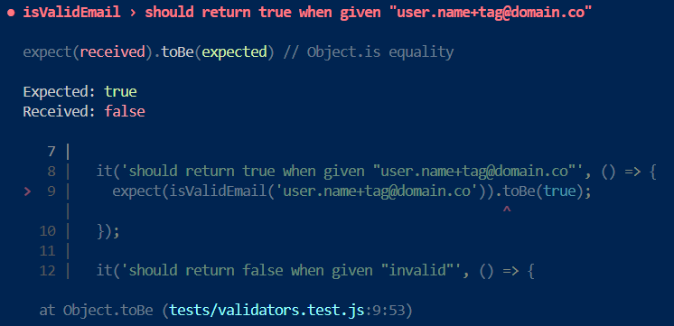

**Why the other tests still passed:** the invalid cases (`"invalid"`, `"@domain.com"`, `"user@"`, `""`, `null`) were already expected to return `false` — the broken regex still returned `false` for them, so those tests passed by coincidence.

**Fix:** restore `@` in the regex.

---

### Bug 3 — capitalize: missing toLowerCase

**Change made:** removed `.toLowerCase()` from `capitalize`.

```js
// buggy
return str.slice(0, index) + str[index].toUpperCase() + str.slice(index + 1);
```

**Tests failed:** 1 out of 7 — only `"WORLD"`.

**Reading the error:**

`"WORLD"` → received `"WORLD"` instead of `"World"`. Without `.toLowerCase()`, the remaining characters keep their original case.

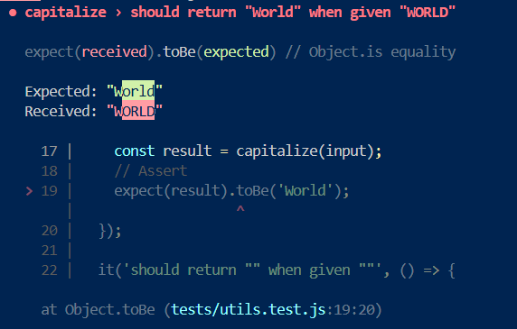

**Why the other tests still passed:** `"hello"`, `"a"`, `"hello2world"`, `"!hello"` — all inputs were already lowercase, so removing `.toLowerCase()` had no effect. `""` and `null` — early return, never reaches the logic.

**Fix:** restore `.toLowerCase()` on `str.slice(index + 1)`.

---

## A4 — TDD: sortStudents

`sortStudents(students, sortBy, order)` sorts an array of `{ name, grade, age }` objects by any field in ascending or descending order. Built using strict TDD: each test was written first (RED), then the minimum code was written to make it pass (GREEN).

**Signature:**
```js
sortStudents(students, sortBy, order = 'asc')
```

| Parameter | Type | Description |
|---|---|---|
| `students` | `array` | Array of `{ name, grade, age }` objects |
| `sortBy` | `string` | `"name"`, `"grade"` or `"age"` |
| `order` | `string` | `"asc"` (default) or `"desc"` |

**Tests written:**

| # | Test | Result |
|---|---|---|
| 1 | should sort students by grade ascending | RED → GREEN |
| 2 | should sort students by grade descending | RED → GREEN |
| 3 | should sort students by name ascending | RED → GREEN |
| 4 | should sort students by age ascending | free test (GREEN) |
| 5 | should return empty array for null input | RED → GREEN |
| 6 | should return empty array for empty input | free test (GREEN) |
| 7 | should not modify the original array | free test (GREEN) |
| 8 | should default to ascending order when order is not specified | free test (GREEN) |

### Red/Green cycles

**Test 1 — sort by grade ascending**

RED: function didn't exist yet → `TypeError: sortStudents is not a function`

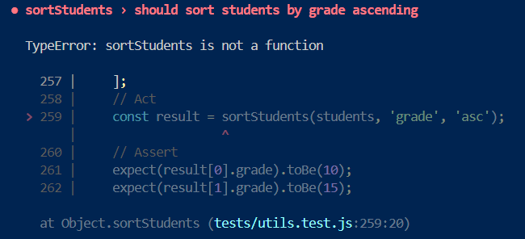

GREEN: implemented minimum — sort by `grade` ascending only, `order` ignored.

---

**Test 2 — sort by grade descending**

RED: `order` parameter ignored → result was ascending instead of descending.

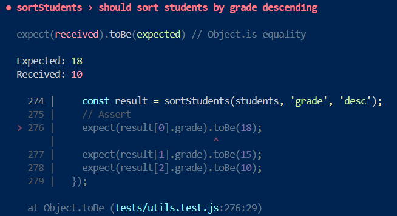

GREEN: added `order === 'asc'` condition to reverse comparison.

---

**Test 3 — sort by name ascending**

RED: `sortBy` parameter ignored, always sorted by `grade`.

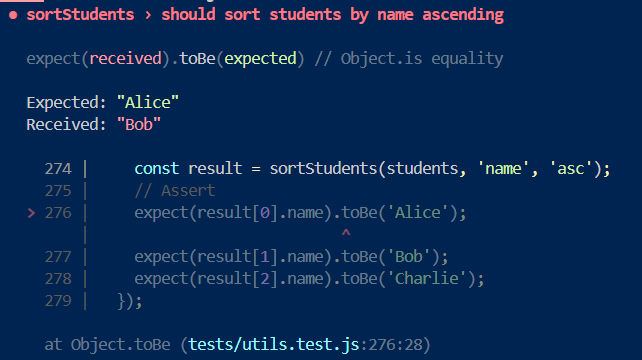

GREEN: replaced `a.grade` with `a[sortBy]` to support any field.

---

**Tests 4, 6, 7, 8 — age / empty / original / default order**

These were **free tests** — the existing implementation already handled these cases correctly. No code change needed.

---

**Test 5 — null input**

RED: `null` passed to spread operator → `TypeError: students is not iterable`

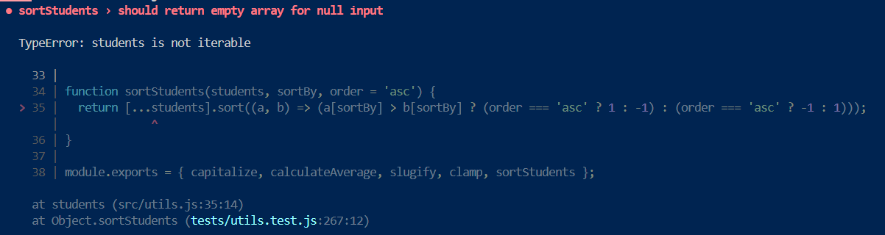

GREEN: added `if (!students) return []` guard.

---

## A5 — parsePrice

Converts a price in various formats to a number.

```js
parsePrice(input)
```

| Input | Expected output |
|---|---|
| `"12.99"` | `12.99` |
| `"12,99"` | `12.99` |
| `"12.99 €"` | `12.99` |
| `"€12.99"` | `12.99` |
| `12.99` (number) | `12.99` |
| `"gratuit"` | `0` |
| `"abc"` | `null` |
| `"-5.00"` | `null` |
| `null` | `null` |

**Logic:**
1. `null` / `undefined` → `null`
2. Number → negative returns `null`, otherwise return as-is
3. String `"gratuit"` → `0`
4. String → strip `€`, replace `,` with `.`, parse float → `NaN` or negative returns `null`

---

## A6 — groupBy

Groups an array of objects by the value of a given key. Built using TDD.

```js
groupBy(array, key)
```

| Parameter | Type | Description |
|---|---|---|
| `array` | `array` | Array of objects to group |
| `key` | `string` | The key to group by |

**Tests written:**

| # | Test | Result |
|---|---|---|
| 1 | should group objects by a key with multiple groups | RED → GREEN |
| 2 | should group objects by any given key | RED → GREEN |
| 3 | should return `{}` when given an empty array | free test |
| 4 | should return `{}` when given null | RED → GREEN |
| 5 | should throw a TypeError when key does not exist on objects | RED → GREEN |
| 6 | should correctly group when key value is falsy (0) | free test |
| 7 | should throw a TypeError when key value is null | RED → GREEN |
| 8 | should preserve the order of items within each group | free test |
| 9 | should group 1 and "1" into the same group (JS key coercion) | RED → GREEN |
| 10 | should not modify the original array | free test |

### Red/Green cycles

**Test 1 — multiple groups**

RED: function didn't exist → `TypeError: groupBy is not a function`

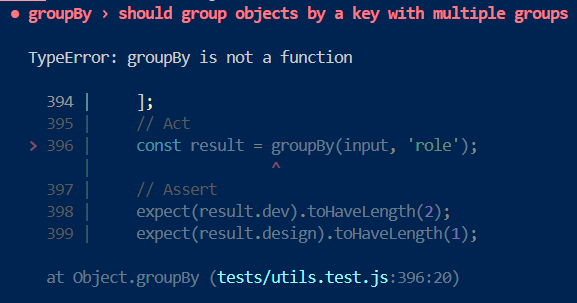

GREEN: implemented with `for...of` loop, hardcoded `item.role`.

---

**Test 2 — any key**

RED: `sortBy` hardcoded to `role` → result grouped by `role` instead of `department`.

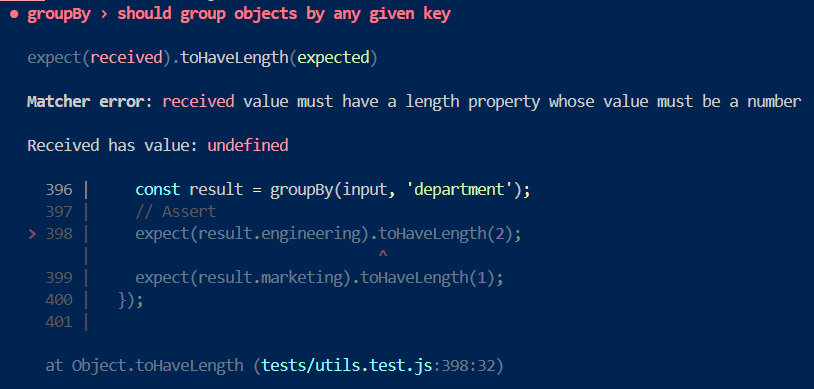

GREEN: replaced `item.role` with `item[key]`.

---

**Test 4 — null input**

RED: `for...of null` → `TypeError: array is not iterable`

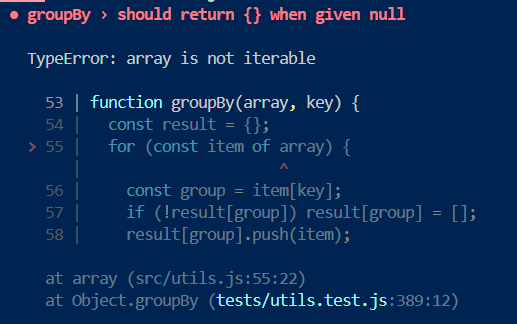

GREEN: added `if (!array) return {}` guard.

---

**Test 5 — unknown key**

RED: function returned `{ undefined: [...] }` instead of throwing.

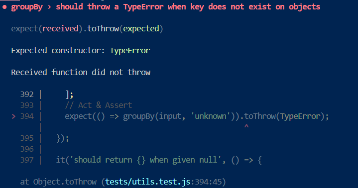

GREEN: added `if (!(key in item)) throw new TypeError(...)`.

---

**Test 7 — null key value**

RED: function grouped items under `"null"` instead of throwing.

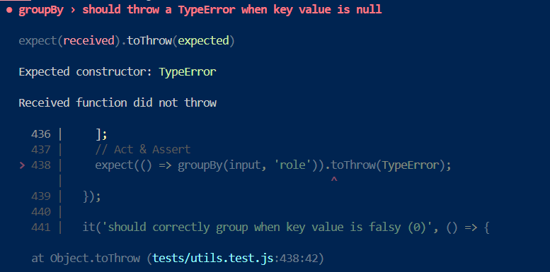

GREEN: added `if (group === null || group === undefined) throw new TypeError(...)`.

---

**Test 9 — type coercion**

RED: `1` and `"1"` were expected to be different groups but JS coerces object keys to strings.

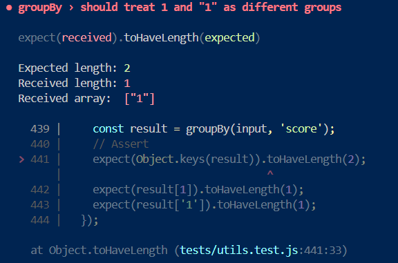

GREEN: updated the test to document the real behavior — `1` and `"1"` end up in the same group `"1"`. No code change needed.

---

## A7 — calculateDiscount

Applies cumulative discount rules to a price. Rules are applied in order. The result cannot be negative.

```js
calculateDiscount(price, discountRules)
```

**Rule types:**

| Type | Fields | Description |
|---|---|---|
| `percentage` | `value` | Reduces price by a percentage |
| `fixed` | `value` | Reduces price by a fixed amount |
| `buyXgetY` | `buy`, `free`, `itemPrice` | Every N items bought, M items are free |

### percentage rules

| # | Test | Result |
|---|---|---|
| 1 | should apply a percentage discount | RED → GREEN |
| 2 | should return original price when percentage value is 0 | free test |
| 3 | should return 0 when percentage value is 100 | free test |
| 4 | should return 0 when percentage discount exceeds the price | RED → GREEN |
| 5 | should apply multiple percentage discounts cumulatively | free test |
| 6 | should throw a TypeError when percentage value is not a number | RED → GREEN |
| 7 | should throw a TypeError when percentage value is negative | RED → GREEN |
| 8 | should throw a TypeError when price is negative | RED → GREEN |
| 9 | should throw a TypeError when price is null | RED → GREEN |
| 10 | should throw a TypeError when rules is null | free test |
| 11 | should return original price when rules is empty | free test |

**Red/Green cycles:**

**Test 1 — percentage discount**

RED: function didn't exist → `TypeError: calculateDiscount is not a function`

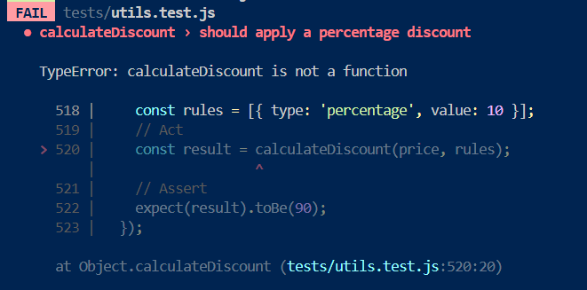

GREEN: implemented loop over rules, handle `percentage` type only.

---

**Test 4 — discount exceeds price**

RED: `value: 150` → result was `-50` instead of `0`.

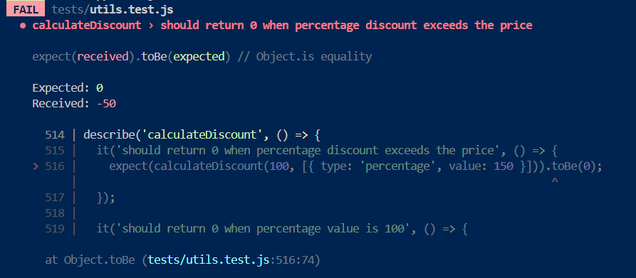

GREEN: added `Math.max(0, result)` at the end.

---

**Test 6 — value not a number**

RED: function returned `NaN` silently instead of throwing.

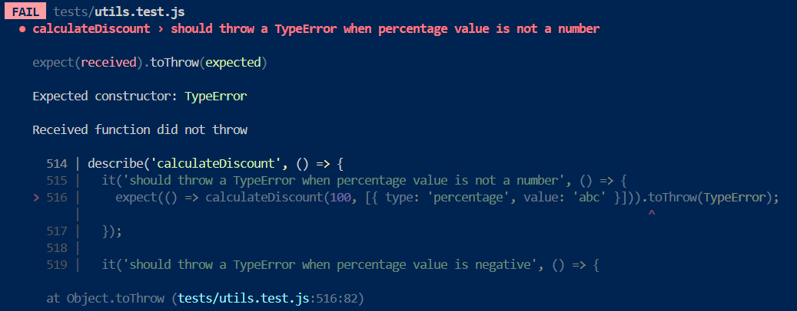

GREEN: added `typeof rule.value !== 'number'` check.

---

**Test 7 — negative value**

RED: function applied a negative discount (price increased) instead of throwing.

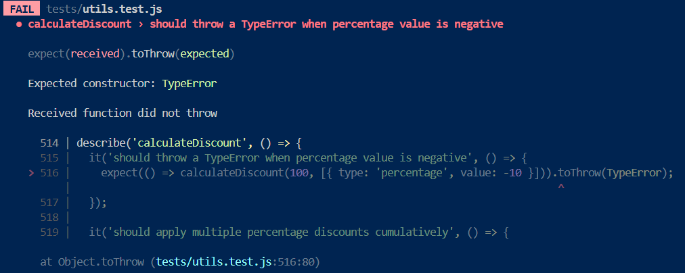

GREEN: added `rule.value < 0` check.

---

**Test 8 — negative price**

RED: function returned a result instead of throwing.

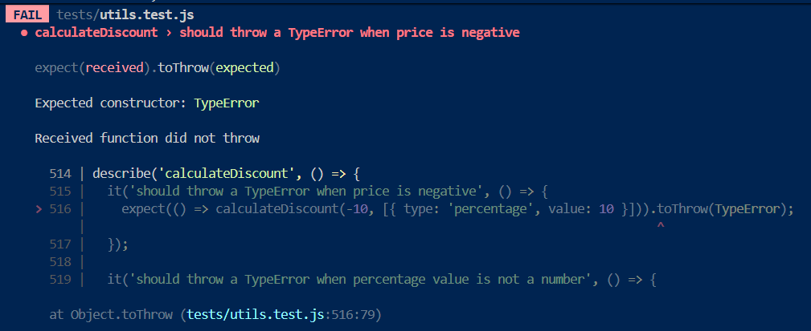

GREEN: added `price < 0` guard.

---

**Test 9 — null price**

RED: function returned `NaN` instead of throwing.

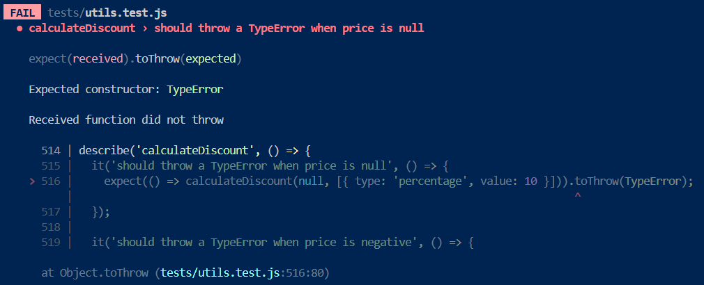

GREEN: added `price === null || price === undefined` guard.

### fixed rules

| # | Test | Result |
|---|---|---|
| 1 | should apply a fixed discount | RED → GREEN |
| 2 | should return 0 when fixed discount exceeds the price | free test |
| 3 | should throw a TypeError when fixed value is negative | RED → GREEN |
| 4 | should apply percentage then fixed discount in order | free test |

**Red/Green cycles:**

**Test 1 — fixed discount**

RED: `fixed` type not handled → price unchanged, returned `100` instead of `95`.

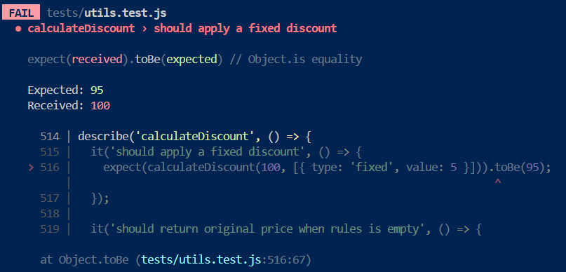

GREEN: added `else if (rule.type === 'fixed')` branch.

---

**Test 3 — negative fixed value**

RED: function applied a negative fixed discount (price increased) instead of throwing.

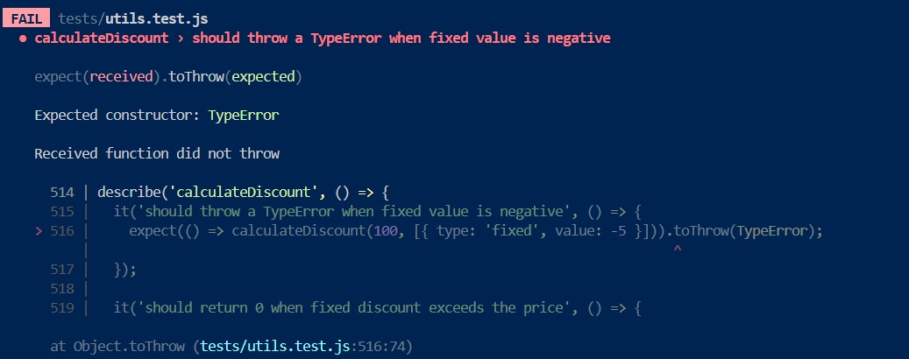

GREEN: added `rule.value < 0` check in the `fixed` branch.

### buyXgetY rules

For every group of `buy + free` items, `free` items are free. Quantity is derived from `price / itemPrice`.

| # | Test | Result |
|---|---|---|
| 1 | should apply a buyXgetY discount | RED → GREEN |
| 2 | should return original price when quantity is not enough | free test |
| 3 | should apply buyXgetY multiple times when quantity allows it | free test |
| 4 | should apply buyXgetY then percentage in order | free test |
| 5 | should return original price when free is 0 | free test |
| 6 | should handle price not divisible by itemPrice | free test |
| 7 | should throw TypeError when itemPrice is not a number | RED → GREEN |
| 8 | should throw TypeError when buy is not a number | free test |
| 9 | should throw TypeError when free is not a number | free test |
| 10 | should throw TypeError when itemPrice is 0 | free test |
| 11 | should throw TypeError when buy is 0 | free test |

**Red/Green cycles:**

**Test 1 — buyXgetY discount**

RED: `buyXgetY` type not handled → price unchanged, returned `40` instead of `30`.

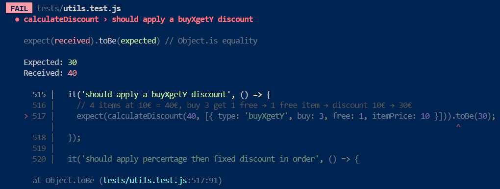

GREEN: added `buyXgetY` branch — derive quantity from `price / itemPrice`, compute free items, subtract discount.

---

**Test 7 — itemPrice not a number**

RED: function returned `NaN` silently instead of throwing.

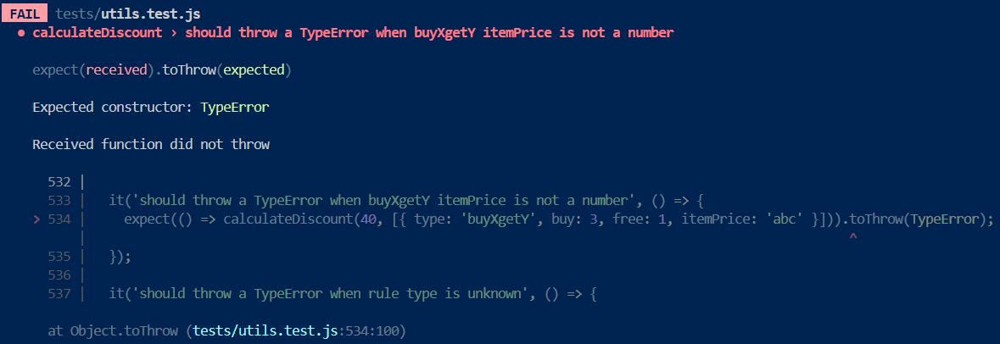

GREEN: added type checks for `itemPrice`, `buy`, `free` and value checks for `itemPrice > 0` and `buy > 0`.

---

**Unknown rule type**

RED: function silently ignored unknown rule types instead of throwing.

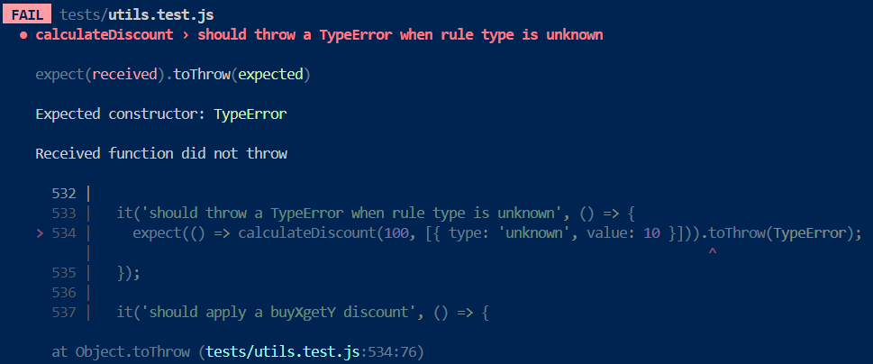

GREEN: added `else` branch that throws `TypeError`.

---

## B1 — Pricing Engine

Pricing functions for the delivery system. Built using TDD.

### calculateDeliveryFee

Computes the delivery fee from a distance (km) and weight (kg). Built using TDD.

```js
calculateDeliveryFee(distance, weight)
```

**Pricing rules:**

| Condition | Rule |
|---|---|
| `distance === 0` | Click & collect — fee is `0.00` (no weight surcharge) |
| `distance > 10` | Throws `RangeError` — delivery unavailable |
| `distance < 0` or `weight < 0` | Throws `TypeError` |
| Either argument is not a number | Throws `TypeError` |
| Base fee | `2.00` for any distance ≤ 3 km |
| Distance surcharge | `+0.50` per km beyond 3 km |
| Weight surcharge | `+1.50` if weight > 5 kg |

**Tests written:**

| # | Test | Result |
|---|---|---|
| 1 | should return 2.00 when distance is 2 km and weight is 1 kg | RED → GREEN |
| 2 | should throw a TypeError when distance is not a number | RED → GREEN |
| 3 | should throw a TypeError when weight is not a number | free test |
| 4 | should return 2.00 when weight is 0 | free test |
| 5 | should return 2.25 when distance is 3.5 km | RED → GREEN |
| 6 | should return 3.50 when weight is 5.1 kg and distance is 2 km | RED → GREEN |
| 7 | should return 0.00 when distance is 0 (click & collect) | RED → GREEN |
| 8 | should throw a TypeError when weight is negative | RED → GREEN |
| 9 | should throw a RangeError when distance is greater than 10 km | RED → GREEN |
| 10 | should throw a TypeError when distance is negative | RED → GREEN |
| 11 | should return 2.00 when distance is 2 km and weight is exactly 5 kg | free test |
| 12 | should return 7.00 when distance is 10 km and weight is 6 kg | free test |
| 13 | should return 4.50 when distance is 5 km and weight is 8 kg | free test |
| 14 | should return 5.50 when distance is exactly 10 km | free test |
| 15 | should return 2.00 when distance is exactly 3 km | free test |
| 16 | should return 3.50 when distance is 6 km and weight is 2 kg | free test |
| 17 | should return 4.00 when distance is 7 km and weight is 3 kg | free test |

### Red/Green cycles

**Test 1 — base fee**

RED: function didn't exist → `TypeError: calculateDeliveryFee is not a function`

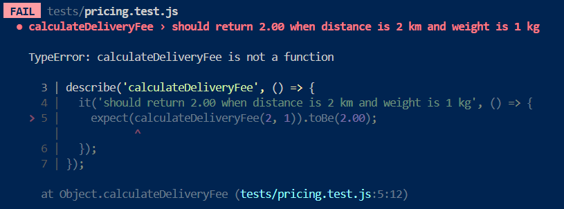

GREEN: created function, hardcoded `return 2.00`.

---

**Test 2 — distance not a number**

RED: no type check → function silently returned `NaN`.

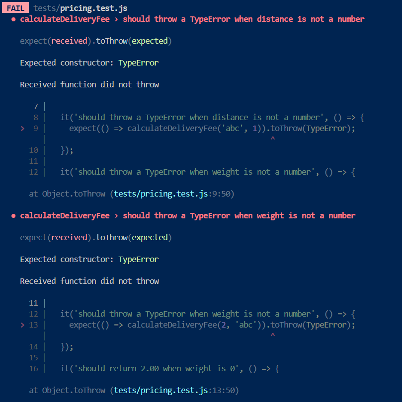

GREEN: added `typeof distance !== 'number'` and `typeof weight !== 'number'` checks.

---

**Test 5 — distance surcharge**

RED: always returned `2.00` regardless of distance.

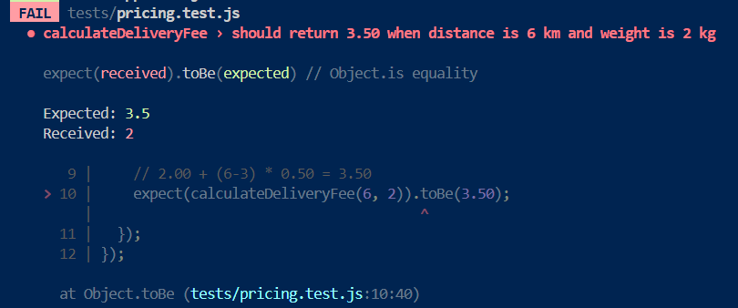

GREEN: added `if (distance > 3) fee += (distance - 3) * 0.50`.

---

**Test 6 — weight surcharge**

RED: weight ignored → returned `2.00` instead of `3.50`.

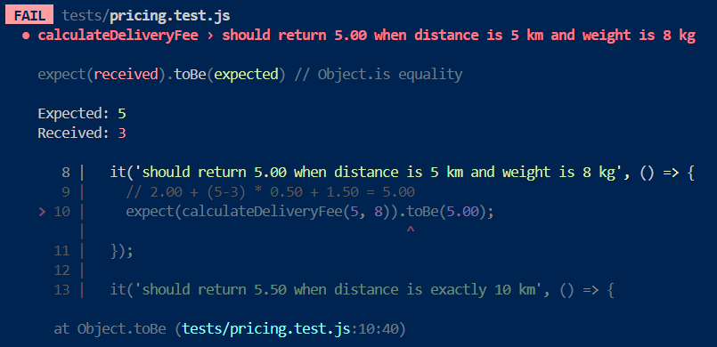

GREEN: added `if (weight > 5) fee += 1.50`.

---

**Test 7 — click & collect**

RED: distance=0 was treated as a normal delivery → returned `2.00` instead of `0.00`.

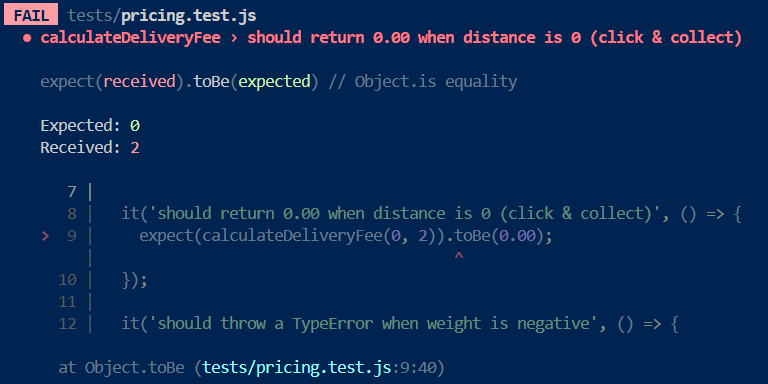

GREEN: added `if (distance === 0) return 0.00` before the base fee.

---

**Test 8 — negative weight**

RED: negative weight passed silently → no error thrown.

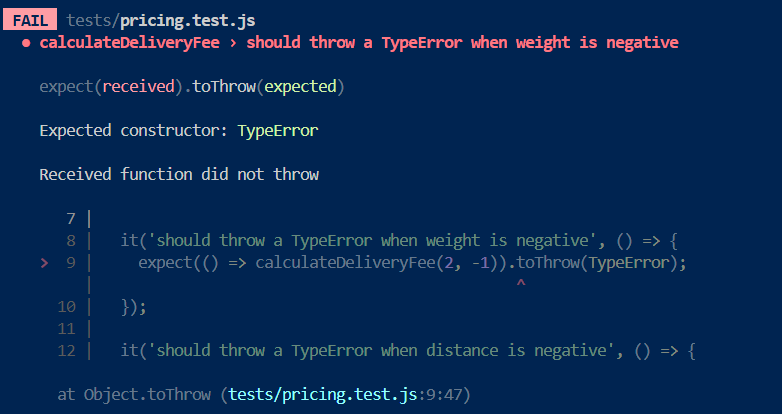

GREEN: added `if (weight < 0) throw new TypeError(...)`.

---

**Test 9 — distance out of range**

RED: distance > 10 returned a fee instead of throwing.

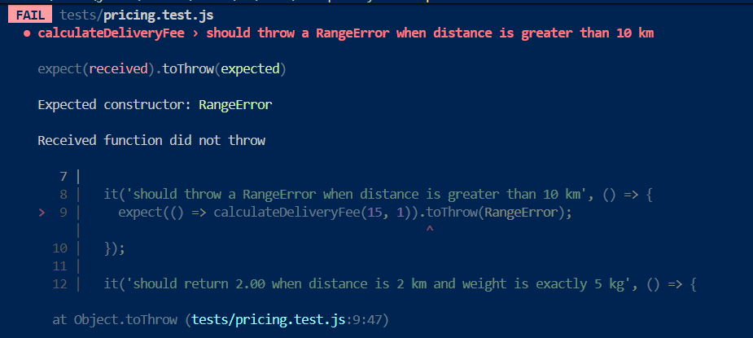

GREEN: added `if (distance > 10) throw new RangeError(...)`.

---

**Test 10 — negative distance**

RED: negative distance was being accepted silently.

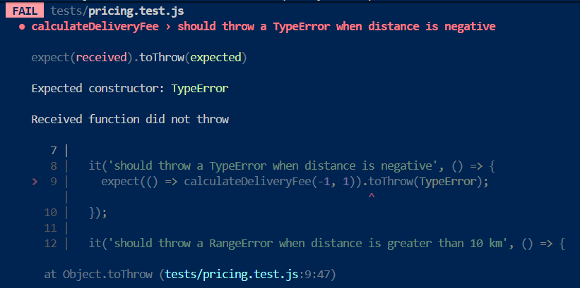

GREEN: added `if (distance < 0) throw new TypeError(...)`.

---

**Tests 3, 4, 11–17 — boundary and combination cases**

These were **free tests** — the implementation already covered these cases correctly. No code change needed.

---

### applyPromoCode

Applies a promo code to a subtotal. Delegates the discount calculation to `calculateDiscount` (A7). Built using TDD.

```js
applyPromoCode(subtotal, promoCode, promoCodes)
```

**Promo code structure:**

```js
{ code: 'BIENVENUE20', type: 'percentage', value: 20, minOrder: 15.00, expiresAt: '2026-12-31' }
```

**Rules:**

| Condition | Behaviour |
|---|---|
| `promoCode` is `null` or `""` | Returns subtotal unchanged |
| `subtotal < 0` | Throws `TypeError` |
| Code not found in list | Throws `Error` |
| `expiresAt < today` | Throws `Error` — code expired |
| `expiresAt === today` | Accepted — still valid |
| `subtotal < minOrder` | Throws `Error` — order too small |
| Type `percentage` | Reduces by X% via `calculateDiscount` |
| Type `fixed` | Reduces by X€ via `calculateDiscount` |
| Result < 0 | Clamped to `0` (handled by `calculateDiscount`) |

**Tests written:**

| # | Test | Result |
|---|---|---|
| 1 | should apply a percentage discount of 20% on 50€ | RED → GREEN |
| 2 | should apply a fixed discount of 5€ on 30€ | RED → GREEN |
| 3 | should return the subtotal unchanged when promoCode is null | RED → GREEN |
| 4 | should return the subtotal unchanged when promoCode is an empty string | RED → GREEN |
| 5 | should throw a TypeError when subtotal is negative | passed in RED* |
| 6 | should throw an Error when promo code does not exist | passed in RED* |
| 7 | should throw an Error when promo code is expired | passed in RED* |
| 8 | should throw an Error when subtotal is below minOrder | passed in RED* |
| 9 | should return 0 when fixed discount exceeds subtotal | RED → GREEN |
| 10 | should return 0 when percentage is 100% | RED → GREEN |
| 11 | should accept a code that expires today | RED → GREEN |
| 12 | should return 0 when subtotal is 0 and promoCode is null | RED → GREEN |
| 13 | should return subtotal unchanged when promoCodes is null | RED → GREEN |
| 14 | should return subtotal unchanged when promoCodes is empty | RED → GREEN |
| 15 | should apply discount when subtotal equals minOrder exactly | free test |
| 16 | should throw a TypeError when subtotal is not a number | RED → GREEN |

*Tests 5, 6, 7, 8 passed during the RED phase because `applyPromoCode is not a function` throws a `TypeError`. Since all four tests use `.toThrow(Error/TypeError)` and `TypeError` is a subclass of `Error`, they were satisfied by the wrong reason.

### Red/Green cycles

**RED — all tests at once**

Tous les tests ont été écrits avant toute implémentation. 8 tests ont échoué avec `TypeError: applyPromoCode is not a function`. Les 4 tests utilisant `.toThrow()` (tests 5, 6, 7, 8) ont passé accidentellement — le `TypeError` de "not a function" satisfaisait la condition.

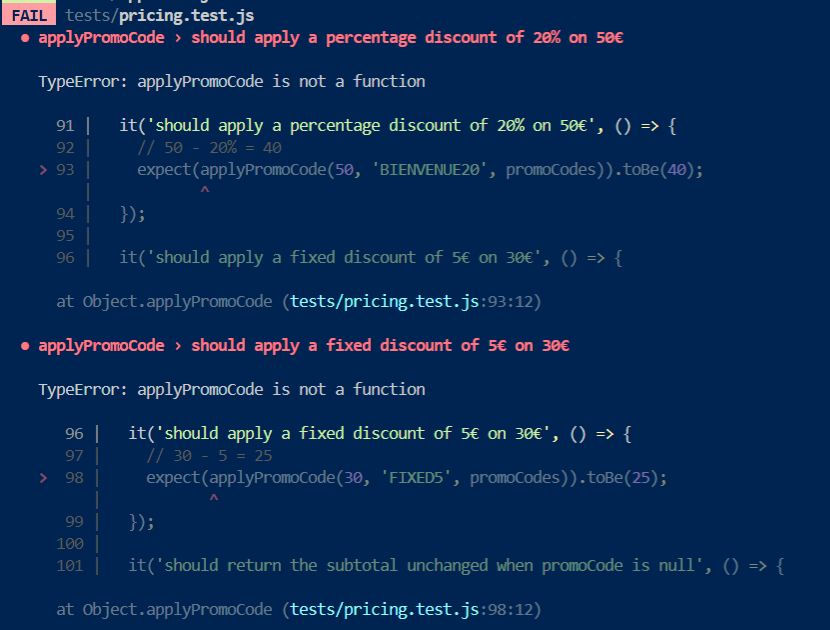

---

**GREEN — implémentation complète en une passe**

- `if (typeof subtotal !== 'number')` → `TypeError`
- `if (subtotal < 0)` → `TypeError`
- `if (!promoCode) return subtotal` → gère `null` et `""`
- `if (!promoCodes || promoCodes.length === 0) return subtotal` → pas de liste = pas de réduction
- `promoCodes.find(...)` + `if (!promo)` → `Error` pour code inconnu
- `if (promo.expiresAt < today)` → `Error` pour code expiré (strict `<` donc aujourd'hui = encore valide)
- `if (subtotal < promo.minOrder)` → `Error` si commande sous le minimum
- `calculateDiscount(subtotal, [{ type, value }])` → délègue le calcul, gère déjà le clamp à `0`

---

**Test 13 — promoCodes null**

RED: `promoCodes.find` sur `null` → `TypeError: Cannot read properties of null`

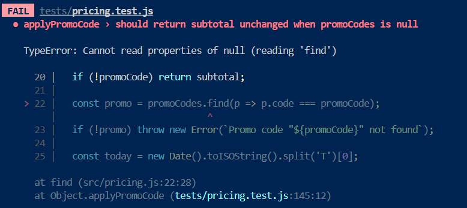

GREEN: ajout de `if (!promoCodes) return subtotal`.

---

**Test 14 — promoCodes vide**

RED: liste vide → `promoCodes.find` retourne `undefined` → `Error: Promo code not found` au lieu de retourner le subtotal.

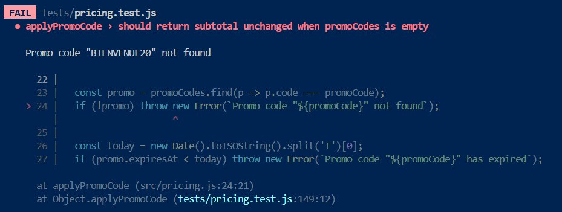

GREEN: guard étendu à `if (!promoCodes || promoCodes.length === 0) return subtotal`.

---

**Test 15 — subtotal === minOrder**

Free test — le guard `subtotal < promo.minOrder` utilise `<` (strict), donc l'égalité exacte est acceptée.

---

**Test 16 — subtotal non-number**

RED: `'50' < 0` est `false` en JS → aucune erreur levée, la fonction continuait sans problème.

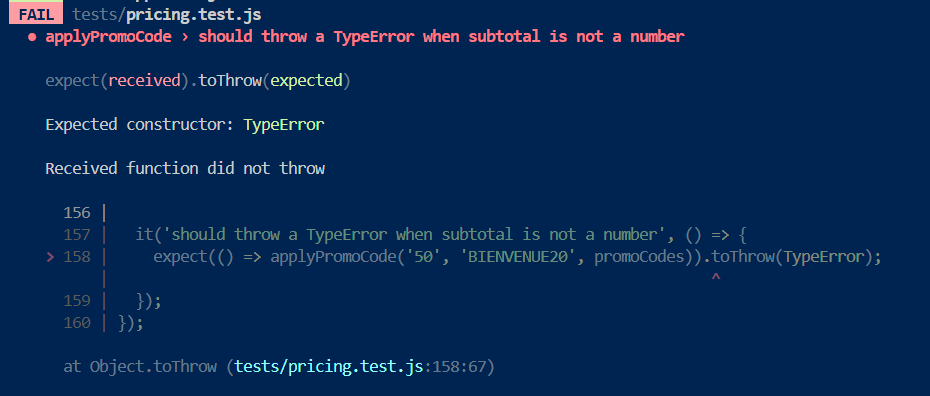

GREEN: ajout de `if (typeof subtotal !== 'number') throw new TypeError(...)`.

---

### calculateSurge

Returns the price multiplier based on the time and day of the week. Built using TDD.

```js
calculateSurge(hour, dayOfWeek)
```

**Parameters:** `hour` = decimal number (e.g. `11.5` for 11h30), `dayOfWeek` = 0 (Sunday) to 6 (Saturday) — same convention as `Date.getDay()`.

**Surge rules:**

| Condition | Multiplier |
|---|---|
| `hour < 10` or `hour >= 22` | 0 (closed) |
| Sunday (0), open hours | 1.2 |
| Fri-Sat (5-6), 18h-22h | 1.8 |
| Saturday (6), 11h30-14h | 1.5 |
| Mon-Fri (1-5), 11h30-14h | 1.3 |
| Mon-Thu (1-4), 18h-22h | 1.5 |
| Mon-Fri (1-5), 10h-11h30 or 14h-18h | 1.0 |
| Saturday (6), other open hours | 1.2 |

**Tests written:**

| # | Test | Result |
|---|---|---|
| 1 | should return 1.0 on Tuesday at 15h (normal) | RED → GREEN |
| 2 | should return 1.3 on Wednesday at 12h30 (lunch) | RED → GREEN |
| 3 | should return 1.5 on Thursday at 20h (dinner) | RED → GREEN |
| 4 | should return 1.8 on Friday at 20h (Fri-Sat evening) | RED → GREEN |
| 5 | should return 1.8 on Saturday at 20h (Fri-Sat evening) | free test |
| 6 | should return 1.2 on Sunday at 14h | RED → GREEN |
| 7 | should return 1.5 on Saturday at 12h30 (lunch) | RED → GREEN |
| 8 | should return 1.2 on Saturday at 15h (normal) | RED → GREEN |
| 9 | should return 0 on Monday at 22h (closed) | RED → GREEN |
| 10 | should return 0 on Monday at 9h (before opening) | free test |
| 11 | should return 1.3 on Monday at 11h30 (start of lunch) | free test |
| 12 | should return 1.3 on Friday at 11h30 (lunch) | free test |
| 13 | should return 1.5 on Monday at 18h (start of dinner) | free test |

### Red/Green cycles

**Test 1 — normal multiplier**

RED: function didn't exist → `TypeError: calculateSurge is not a function`

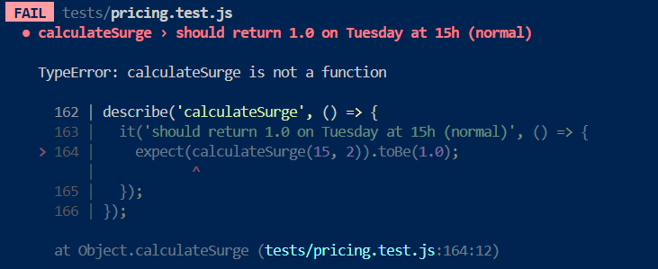

GREEN: created function, hardcoded `return 1.0`.

---

**Test 2 — lunch**

RED: always returned `1.0` instead of `1.3`.

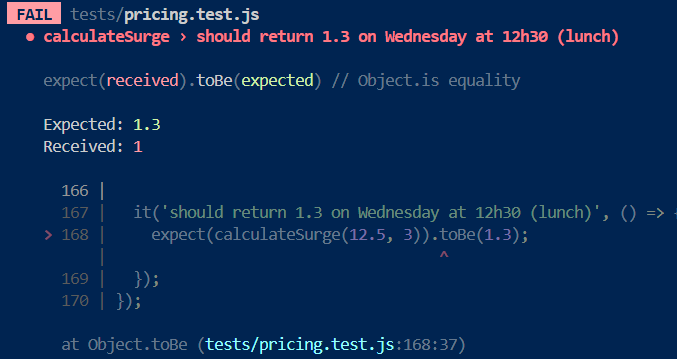

GREEN: added `if (hour >= 11.5 && hour < 14) return 1.3`.

---

**Test 3 — dinner Mon-Thu**

RED: Thursday 20h returned `1.0` instead of `1.5`.

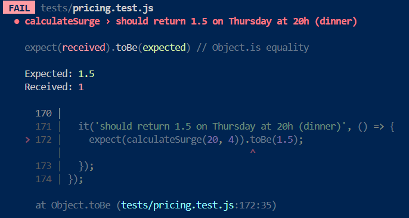

GREEN: added `if (dayOfWeek >= 1 && dayOfWeek <= 4 && hour >= 18) return 1.5`.

---

**Test 4 — Fri-Sat evening**

RED: Friday 20h returned `1.0` (not in Mon-Thu range) instead of `1.8`.

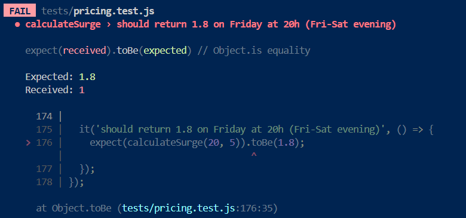

GREEN: added `if ((dayOfWeek === 5 || dayOfWeek === 6) && hour >= 18) return 1.8` before the dinner rule.

---

**Test 6 — Sunday**

RED: Sunday 14h returned `1.0` instead of `1.2`.

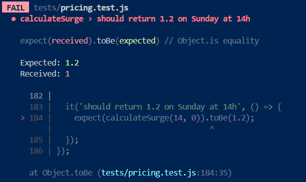

GREEN: added `if (dayOfWeek === 0) return 1.2`.

---

**Test 7 — Saturday lunch**

RED: Saturday 12h30 returned `1.3` (generic lunch rule) instead of `1.5`.

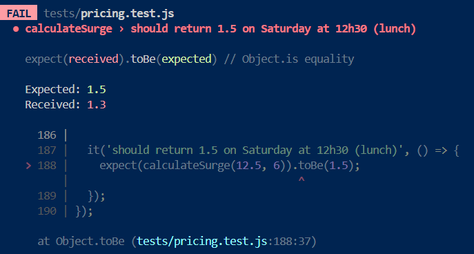

GREEN: added `if (dayOfWeek === 6 && hour >= 11.5 && hour < 14) return 1.5` before the generic lunch rule.

---

**Test 8 — Saturday normal**

RED: Saturday 15h returned `1.0` instead of `1.2` — Saturday was not in the Sunday guard.

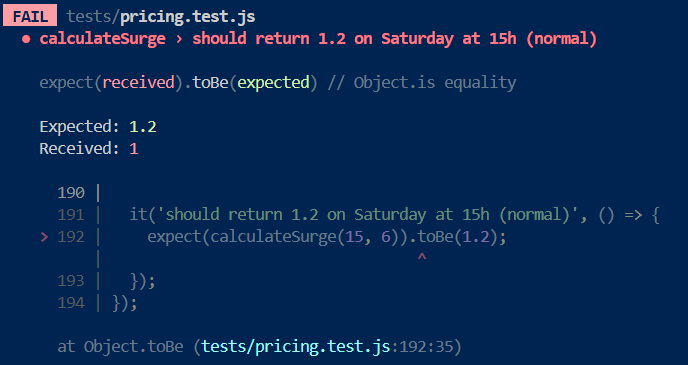

GREEN: extended guard to `if (dayOfWeek === 0 || dayOfWeek === 6) return 1.2`.

---

**Test 9 — closed**

RED: Monday 22h returned `1.5` (dinner rule) instead of `0`.

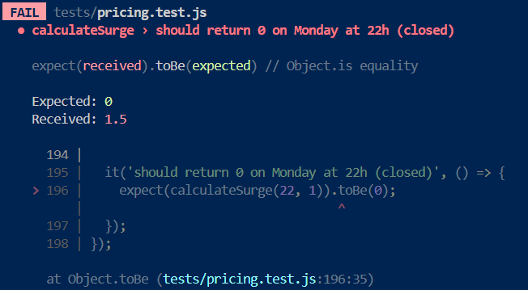

GREEN: added `if (hour < 10 || hour >= 22) return 0` as the first check.

---

**Tests 5, 10, 11, 12, 13 — free tests**

Already covered by the implementation at the time they were added. No code change needed.

---

### calculateOrderTotal

Assembles all pricing functions into a single order calculation. Built using TDD.

```js
calculateOrderTotal(items, distance, weight, promoCode, promoCodes, hour, dayOfWeek)
```

**Steps:**
1. Validate items (non-empty, quantity > 0, price ≥ 0)
2. Calculate subtotal: sum of `price * quantity`
3. Apply promo code via `applyPromoCode`
4. Calculate base delivery fee via `calculateDeliveryFee`
5. Apply surge multiplier via `calculateSurge` — throws if closed (surge = 0)
6. Return `{ subtotal, discount, deliveryFee, surge, total }` — all amounts rounded to 2 decimals

Note: surge applies **only to the delivery fee**, not to the subtotal.

**Tests written:**

| # | Test | Result |
|---|---|---|
| 1 | 2 pizzas, 5km, 2kg, Tuesday 15h → full result | RED → GREEN |
| 2 | Same + BIENVENUE20 → discount = 5, total = 23 | free test |
| 3 | Same, Friday 20h → surge = 1.8, total = 30.40 | free test |
| 4 | items = [] → Error | RED → GREEN |
| 5 | item quantity = 0 → Error | RED → GREEN |
| 6 | item price negative → Error | free test* |
| 7 | 23h → Error (closed) | RED → GREEN |
| 8 | distance 15km → RangeError | free test** |
| 9 | no promo → discount = 0 | free test |
| 10 | rounding: 2.25 × 1.3 = 2.93 | free test |
| 11 | multiple items → subtotal = sum | free test |
| 12 | click & collect (distance = 0) → deliveryFee = 0 | free test |

*Test 6 is free because a negative price produces a negative subtotal, which `applyPromoCode` already rejects with a `TypeError`.

**Test 8 is free because `calculateDeliveryFee` already throws a `RangeError` for distance > 10.

### Red/Green cycles

**Test 1 — full scenario**

RED: `TypeError: calculateOrderTotal is not a function`

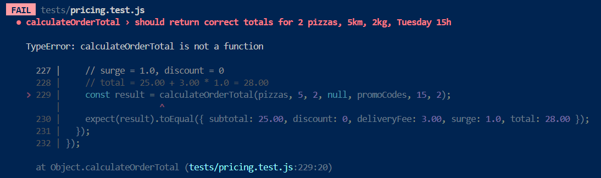

GREEN: implemented full function — subtotal reduce, promo delegation, delivery fee, surge, rounding, return object.

---

**Test 4 — empty items**

RED: empty array returned `{ subtotal: 0, ... }` instead of throwing.

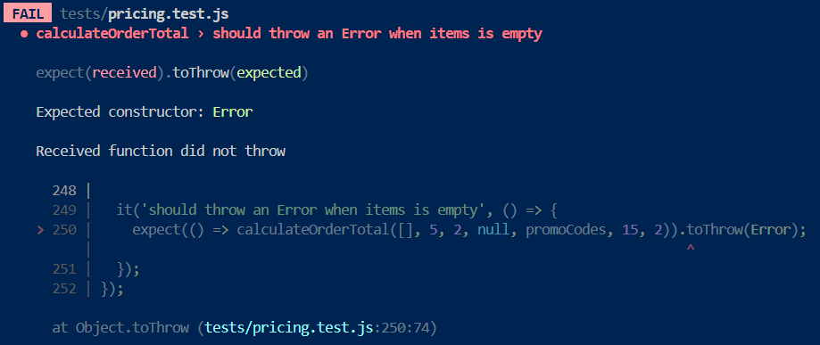

GREEN: added `if (!items || items.length === 0) throw new Error(...)`.

---

**Test 5 — quantity = 0**

RED: quantity 0 passed silently, contributing 0 to subtotal.

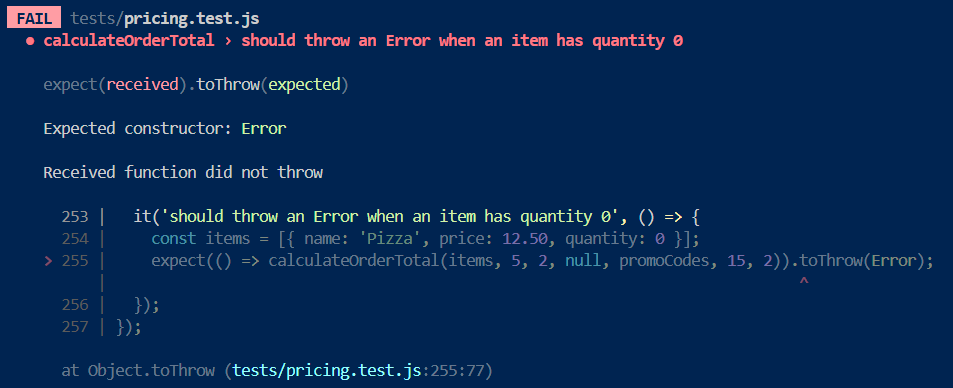

GREEN: added `for...of` loop checking `item.quantity <= 0`.

---

**Test 7 — closed**

RED: `calculateSurge` returned `0` but the function continued and returned a result.

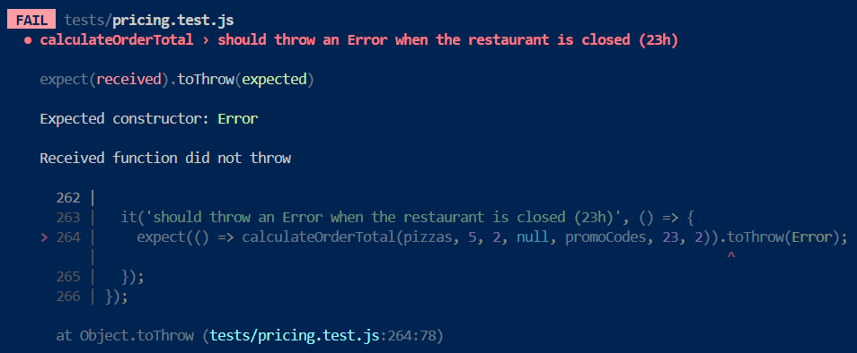

GREEN: added `if (surge === 0) throw new Error('Restaurant is closed at this time')`.

---

## B2 — HTTP API

Exposes the pricing engine via HTTP routes. Tests are integration tests — each test covers the full request → route → logic → response cycle using Supertest.

**Architecture:**
- Routes are registered in `src/routes/` using Express Router
- All errors are forwarded with `next(err)` and handled by a central error middleware in `app.js`
- Orders are stored in memory in `orders.js` with a `resetOrders()` function called in `beforeEach` to ensure test isolation

### POST /orders/simulate

Calculates the order total without saving. Returns `{ subtotal, discount, deliveryFee, surge, total }`.

| # | Test | Status |
|---|---|---|
| 1 | Normal order → 200 + correct price detail | ✓ |
| 2 | With valid promo code → discount applied | ✓ |
| 3 | Expired promo code → 400 + error message | ✓ |
| 4 | Empty cart → 400 | ✓ |
| 5 | Distance > 10km → 400 | ✓ |
| 6 | Closed (23h) → 400 | ✓ |
| 7 | Surge Friday 20h → surge = 1.8, total = 30.40 | ✓ |

### POST /orders

Same as `/simulate` but saves the order in memory with a UUID. Returns the order with its ID. Status `201`.

| # | Test | Status |
|---|---|---|
| 1 | Valid order → 201 + order with ID | ✓ |
| 2 | Order retrievable via GET /orders/:id | ✓ |
| 3 | Two orders → two different IDs | ✓ |
| 4 | Invalid order → 400 | ✓ |
| 5 | Invalid order is not saved | ✓ |

### GET /orders/:id

Returns a saved order by ID.

| # | Test | Status |
|---|---|---|
| 1 | Existing ID → 200 + complete order | ✓ |
| 2 | Non-existing ID → 404 | ✓ |
| 3 | Returned structure has all required fields | ✓ |

### POST /promo/validate

Validates a promo code against an amount. Returns `{ valid, code, discount, newAmount }` or an error. Does not modify any state.

| # | Test | Status |
|---|---|---|
| 1 | Valid code → 200 + discount details | ✓ |
| 2 | Expired code → 400 + reason | ✓ |
| 3 | Amount below minOrder → 400 + reason | ✓ |
| 4 | Unknown code → 404 | ✓ |
| 5 | No code in body → 400 | ✓ |

---

## B3 — Code Coverage

Coverage is measured with Jest's built-in coverage tool (Istanbul).

```bash
npm run test:coverage
```

### Configuration

`package.json` jest config:
- `collectCoverageFrom: ["src/**/*.js", "!src/server.js"]` — collects from all source files, excludes `server.js` (entry point with no testable logic)
- `coverageThreshold: { global: { lines: 80, functions: 80, branches: 80, statements: 80 } }` — fails the run if any metric drops below 80%
- `coverage/` is excluded from git via `.gitignore`

### Result

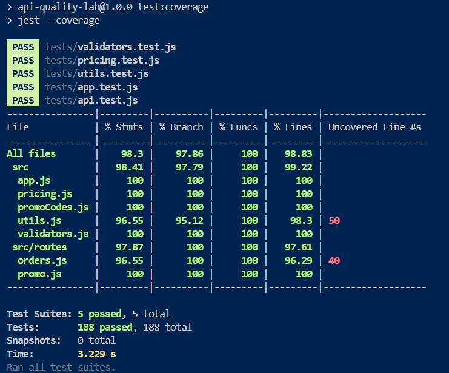

| File | Statements | Branches | Functions | Lines |
|---|---|---|---|---|
| app.js | 100% | 100% | 100% | 100% |
| pricing.js | 100% | 100% | 100% | 100% |
| promoCodes.js | 100% | 100% | 100% | 100% |
| utils.js | 96.55% | 95.12% | 100% | 98.3% |
| validators.js | 100% | 100% | 100% | 100% |
| orders.js | 96.55% | 100% | 100% | 96.29% |
| promo.js | 100% | 100% | 100% | 100% |
| **All files** | **98.3%** | **97.86%** | **100%** | **98.83%** |

All 188 tests pass. Coverage is well above the 80% threshold on every metric.

Two minor uncovered lines remain intentionally untested:
- `utils.js:50` — final `return null` fallback in `parsePrice`, unreachable with valid inputs
- `orders.js:40` — `next(err)` in GET `/:id` catch block, no realistic error path through that code

---

## Issues encountered

**ESLint — `require` / `module` / `process` not defined**

ESLint v9 does not assume any runtime environment by default. It flagged Node.js globals (`require`, `module`, `process`, `console`) as undefined.

Fix: explicitly declare the Node.js globals in `eslint.config.js` using the `globals` package:

```js
const globals = require('globals');

languageOptions: {
  globals: {
    ...globals.node,
  },
},
```

---

**slugify — trailing dash on input ending with a special character**

Input `"C'est l'ete !"` was producing `"cest-lete-"` instead of `"cest-lete"`.

Root cause: the space before `!` was converted to `-`, then `!` was removed — leaving a trailing dash.

Fix: add a `.replace(/^-+|-+$/g, '')` step to strip leading and trailing dashes after cleanup.

---

**slugify — double dash when a special character is surrounded by spaces**

Input `"hello ! world"` was producing `"hello--world"` instead of `"hello-world"`.

Root cause: spaces were replaced by dashes before special characters were removed — `"hello-!-world"` → `"hello--world"`.

Fix: remove special characters **before** replacing spaces with dashes:

```js
return text
  .trim()
  .toLowerCase()
  .replace(/[^a-z0-9\s-]/g, '') // remove special chars first
  .replace(/\s+/g, '-')          // then replace spaces
  .replace(/^-+|-+$/g, '');      // strip leading/trailing dashes
```

---

**clamp — non-number arguments produce NaN silently**

`clamp('a', 0, 10)` would return `NaN` without error because `Math.max('a', 0)` propagates `NaN` silently in JavaScript.

Fix: validate all three arguments upfront and throw a `TypeError` if any is not a number:

```js
if (typeof value !== 'number' || typeof min !== 'number' || typeof max !== 'number') {
  throw new TypeError('value, min and max must be numbers');
}
```

---

**capitalize — special character at the start**

`"!hello"` was producing `"!hello"` instead of `"!Hello"` because `charAt(0)` was targeting `!`, not the first letter.

Fix: use `str.search(/[a-zA-Z]/)` to find the index of the first alphabetic character:

```js
const index = str.search(/[a-zA-Z]/);
if (index === -1) return str;
return str.slice(0, index) + str[index].toUpperCase() + str.slice(index + 1).toLowerCase();
```
